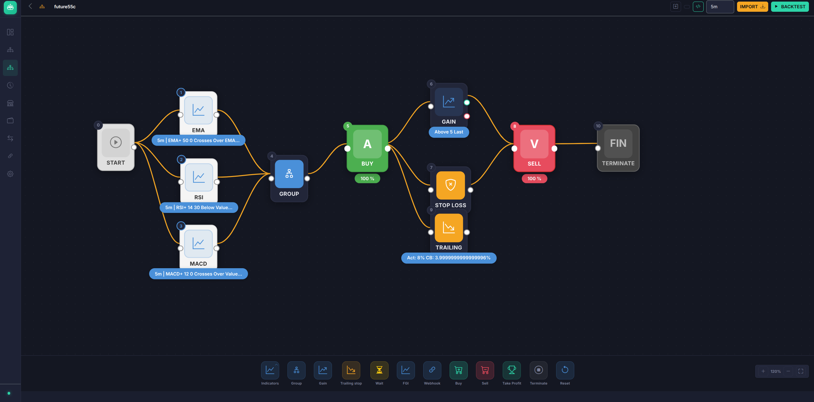
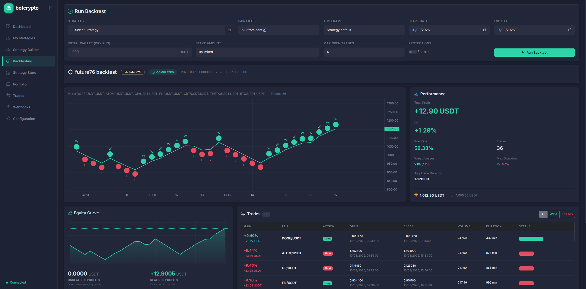

#  freqtrade

User-centric fork of [Freqtrade](https://github.com/freqtrade/freqtrade) — the free and open source crypto trading bot — featuring a new WebGUI inspired by [botcrypto.io](https://botcrypto.io), C++ performance extensions, and critical bug fixes.

[](https://github.com/freqtrade/freqtrade/actions/workflows/ci.yml)
[](https://doi.org/10.21105/joss.04864)
[](https://codecov.io/gh/freqtrade/freqtrade)
[](https://www.freqtrade.io)
[](https://discord.gg/p7nuUNVfP7)

## What's Different From Upstream

This fork adds three major improvements on top of the upstream Freqtrade project:

1. **BotCrypto Web Interface** — A complete trading GUI with visual strategy builder, live dashboard, and backtesting UI
2. **C++ Performance Extensions** — Compiled pybind11 modules that accelerate backtesting, profit calculations, and data processing by 5-50x
3. **Parallel Backtesting** — Indicator calculation and signal generation run across all CPU cores, dramatically reducing backtest time for multi-pair strategies
4. **Bug Fixes & Optimizations** — Thread-safety fixes, O(n) algorithm replacements, and reduced DB overhead

---

## BotCrypto Web Interface

A complete web interface for automated crypto trading that works with Freqtrade's REST API, inspired by [botcrypto.io](https://botcrypto.io)'s design. Built with Bootstrap 5.3 dark theme.

<p align="center">
  
  <br><em>Visual Strategy Builder — drag-and-drop nodes for indicators, actions, and risk management</em>
</p>

<p align="center">
  
  <br><em>Backtesting — run strategies, view equity curve, performance stats, and trade history</em>
</p>

- **Dashboard** — Live trading chart (TradingView), equity curve, portfolio stats, trade history
- **Visual Strategy Builder** — Node-based drag-and-drop canvas with indicator blocks, buy/sell actions, gain conditions, stop-loss, trailing stop, and webhooks — generates Freqtrade Python strategy code automatically
- **Backtesting UI** — Run and visualize backtests directly from the browser with date selection, auto data download, and progress tracking
- **Strategy Store** — 6+ pre-built strategy templates with import/preview functionality
- **Trade Management** — Open/closed trade management, bot controls (start/stop/pause), force trade
- **Configuration Wizard** — 5-step setup for exchange, trading, pairs, risk, and API server
- **Config Database** — Save/load/modify strategy configs via IndexedDB, import `.py` files, apply and restart from the GUI
- **Password Protection** — GUI access protection via `.env` password gate

Integrated as the default Freqtrade GUI (replaces FreqUI, with fallback).

---

## C++ Performance Extensions

Optional compiled C++ modules (via pybind11) that replace the most CPU-intensive Python routines. Falls back gracefully to pure Python if not compiled.

### Modules

| Module | Key Functions | What It Replaces | Speedup |
|--------|--------------|------------------|---------|
| **backtesting** | `simulate_trades()` | Inner backtest loop — OHLCV+signal processing, ROI/stoploss/trailing evaluation | 10-50x |
| **trade_math** | `calculate_profit()`, `calc_profit_ratio()`, `calc_close_rate_for_roi()`, `recalc_trade_from_orders()`, `batch_calc_profit_ratio()` | FtPrecise string-based math in trade_model.py | 5-20x |
| **data_processing** | `combined_nan_mask()`, `shift_features()`, `fillna_and_predict_mask()` | FreqAI NaN filtering and feature shifting in data_kitchen.py | 3-10x |
| **report_gen** | `find_signal_candle_indices()`, `calculate_max_drawdown()`, `aggregate_pair_metrics()`, `calculate_expectancy()` | O(n^2) iterrows+concat loops in optimize_reports.py | 3-10x |
| **orderflow** | `volume_profile()`, `detect_imbalances()`, `find_stacked_imbalances()` | Per-candle string ops and groupby in orderflow.py | 3-5x |
| **indicators** | `heikinashi()`, `rolling_mean/std/sum/min/max()`, `ema()` | Row-by-row `.at[]` loop in qtpylib indicators | 2-5x |

### Building

```bash
# Requires: C++ compiler (g++ or clang++) and pybind11
pip install pybind11
python setup_cpp.py build_ext --inplace
```

### Integration

The C++ modules are already wired into the codebase. When compiled, these paths automatically use the fast versions:

- `qtpylib/indicators.py` — Heikin Ashi uses C++ implementation
- `optimize/optimize_reports.py` — Signal candle extraction uses binary search instead of iterrows
- `freqai/data_kitchen.py` — `filter_features()` and `populate_features()` use C++ NaN filtering and feature shifting

Use directly in custom code:

```python
from freqtrade.ft_cpp import is_available
from freqtrade.ft_cpp.indicators import heikinashi, rolling_mean, ema
from freqtrade.ft_cpp.trade_math import batch_calc_profit_ratio
from freqtrade.ft_cpp.data_processing import nan_mask, shift_features
```

---

## Parallel Backtesting

Upstream Freqtrade runs backtesting on a single CPU core. This fork parallelizes the two most CPU-intensive phases — indicator calculation and signal generation — across all available cores using fork-based multiprocessing, similar to how hyperopt already parallelizes its workload.

### What's parallelized

| Phase | What happens | Parallelism |
|-------|-------------|-------------|
| **Indicator calculation** | `advise_indicators()` per pair | All pairs processed in parallel across CPUs |
| **Signal generation** | `ft_advise_signals()` + data conversion per pair | All pairs processed in parallel across CPUs |
| **Main backtest loop** | Trade simulation with shared wallet state | Sequential (inherently serial due to cross-pair dependencies) |

For strategies with many pairs and complex indicators, the indicator and signal phases dominate runtime — this is where parallel processing provides the most benefit.

### Usage

```bash
# Use all CPUs (default, -1)
freqtrade backtesting --strategy MyStrategy

# Use all CPUs minus one (keep system responsive)
freqtrade backtesting --strategy MyStrategy -j -2

# Use exactly 4 workers
freqtrade backtesting --strategy MyStrategy -j 4

# Disable parallelism (original sequential behavior)
freqtrade backtesting --strategy MyStrategy -j 1
```

The `-j` / `--job-workers` flag works identically to the hyperopt flag of the same name.

---

## Bug Fixes & Optimizations

Fixes applied on top of upstream:

**Critical (P0):**
- Fix bitwise `&` used instead of logical `and` in PercentChangePairList (incorrect boolean evaluation)
- Thread-safe double-checked locking for SingletonMeta (race condition in multi-threaded use)
- Replace `get_open_trades()` with `get_open_trade_count()` to avoid loading full trade objects just for counting

**Important (P1):**
- Fix exception handler ordering in `api_backtest.py` (redundant catches reordered specific-to-general)
- Replace O(n^2) `iterrows()+.loc[]` in entryexitanalysis with vectorized `pd.merge_asof`
- Fix uninitialized `group_mask` variable in `_do_group_table_output`

**Performance (P2):**
- Replace blocking `time.sleep()` polling in exchange_ws.py with `future.result(timeout)`
- Replace O(n^2) `whitelist.remove()` loop with set-based filtering in `enter_positions()`
- Replace unnecessary `deepcopy` of string list with shallow `list()` copy
- Add return type hints to `misc.py` core functions

---

## Core Features

- **All Freqtrade Features** — Backtesting, hyperopt, FreqAI, Telegram control, dry-run mode, and more
- **15+ Exchanges** — Binance, Bybit, OKX, Bitget, Gate.io, Kraken, HTX, Hyperliquid, BingX, Bitmart, and more
- **WhiteBit Support** — Full spot and futures trading on [WhiteBit](https://whitebit.com/) with ccxt compatibility fixes

## Quick Start

```bash
git clone https://github.com/pulpoff/freqtrade.git
cd freqtrade
pip install -e .

# Optional: build C++ extensions for faster backtesting
pip install pybind11
python setup_cpp.py build_ext --inplace

freqtrade trade --config user_data/config.json --strategy YourStrategy
```

See the full [Freqtrade documentation](https://www.freqtrade.io) for detailed setup and configuration.

## Monitoring

Pair with [freqmon](https://github.com/pulpoff/freqmon) for multi-instance monitoring dashboard.

## Disclaimer

This software is for educational purposes only. Do not risk money which you are afraid to lose. Use the software at your own risk. The authors assume no responsibility for your trading results.

## License

[GPLv3](LICENSE)
